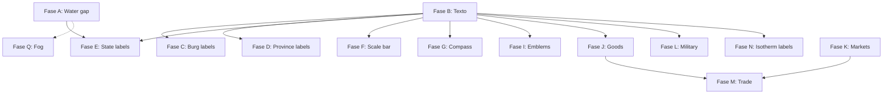

# Plan de implementación: renderizado completo de Voronia

> **Basado en**: Análisis de Azgaar FMG (`docs/landmass-drawing-analysis.md`)
> **Estado actual**: 19/28 capas implementadas, 79 tests, pipeline wgpu funcional
> **Objetivo**: Cubrir el 100% de las capas de dibujo de Azgaar en Voronia

---

## Resumen de lo que ya existe (no tocar)

| Archivo | Capa | Estado |
|---------|------|--------|
| `heightmap.rs` | Malla de elevación | ✅ Completo |
| `relief.rs` | Triángulos de relieve | ✅ Completo |
| `biome.rs` | Relleno de biomas | ✅ Completo |
| `temperature.rs` | Isotermas (mesh) | ✅ Completo |
| `precipitation.rs` | Precipitación (mesh) | ✅ Completo |
| `ice_layer.rs` | Capas de hielo | ✅ Completo |
| `lakes.rs` | Lagos Catmull-Rom | ✅ Completo |
| `river.rs` | Ríos meander + ancho variable | ✅ Completo |
| `coastline.rs` | Costa fractalizada | ✅ Completo |
| `state_layer.rs` | Relleno de estados | ✅ Completo |
| `province_layer.rs` | Relleno de provincias | ✅ Completo |
| `culture_layer.rs` | Relleno de culturas | ✅ Completo |
| `religion_layer.rs` | Relleno de religiones | ✅ Completo |
| `population_layer.rs` | Mapa de población | ✅ Completo |
| `zone_layer.rs` | Zonas overlays | ✅ Completo |
| `burg.rs` | Marcadores de burgo | ✅ Completo |
| `border.rs` | Bordes (state/prov/culture) | ✅ Completo |
| `route_layer.rs` | Rutas (roads/trails/searoutes) | ✅ Completo |
| `cells.rs` | Wireframe de celdas | ✅ Completo |
| `grid.rs` | Líneas de grilla | ✅ Completo |
| `coordinates.rs` | Graticule coordenadas | ✅ Completo |
| `contour.rs` | Isolíneas de altura | ✅ Completo |
| `texture.rs` | Overlay de textura | ✅ Completo |
| `mesh.rs` | Builders compartidos | ✅ Completo |
| `renderer.rs` | Pipeline wgpu | ✅ Completo |
| `camera.rs` | Cámara 2D | ✅ Completo |
| `layers.rs` | LayerFlags + orden | ✅ Completo |

---

## Lo que falta implementar (ordenado por dependencias)

### Fase A: Water gap technique + Landmask

**Por qué**: Azgaar dibuja un stroke del mismo color del relleno en los bordes de cada región que tocan agua (water gap). Sin esto, los colores de estados/biomas/etc. se ven como que "sangran" al océano visualmente. También falta la máscara de tierra que se usa para clipping.

**Archivos a crear/modificar**:
| Archivo | Acción |
|---------|--------|
| `crates/vor-render/src/water_gap.rs` | **NUEVO** — Generar paths de water gap para capas temáticas |
| `crates/vor-render/src/landmask.rs` | **NUEVO** — Generar máscara land/water como stencil o clip |
| `crates/vor-render/src/layers.rs` | Modificar — Agregar layer index para landmask |
| `crates/vor-render/src/lib.rs` | Modificar — Exportar nuevos módulos |
| `crates/vor-render/src/renderer.rs` | Modificar — Nuevo pipeline con stencil test o render target de máscara |

**Algoritmo**:
1. `landmask.rs`: Renderizar todas las features de tierra como blancas, lagos como negro → textura de máscara
2. `water_gap.rs`: Para cada capa temática (biomes, states, etc.), detectar celdas de borde contra océano/lago; dibujar un triángulo delgado (stroke) del mismo color del fill en esos bordes
3. Alternativa más simple: usar el `build_border_mesh` existente pero con el color de la capa en vez de gris, solo en bordes contra agua

**Tests**: Comparar visualmente que regiones no sangren al océano.
**Dependencias previas**: Ninguna (es independiente).

---

### Fase B: Infraestructura de texto (glyphon)

**Por qué**: Todas las etiquetas (burgos, provincias, estados, scale bar) necesitan renderizado de texto. Azgaar usa SVG `<text>`, Voronia necesita texto en GPU.

**Archivos a crear/modificar**:
| Archivo | Acción |
|---------|--------|
| `crates/vor-render/src/text.rs` | **NUEVO** — Sistema de texto con glyphon |
| `crates/vor-render/src/renderer.rs` | Modificar — Agregar text_pass, text_overlay(), font_system |
| `crates/vor-render/src/lib.rs` | Modificar — Exportar text module |
| `crates/vor-render/src/layers.rs` | Modificar — Nueva constante `NUM_LAYERS` si text es post-process |

**glyphon pipeline**:
1. Inicializar `FontSystem` con fuente por defecto (cargar ttf desde assets o embebida)
2. `TextRenderer` que maneja `glyphon::TextRenderer` con wgpu
3. API: `render_text(&self, text: &str, x, y, size, color, align)` → dibuja en un buffer
4. Se renderiza como overlay post-MSAA (último paso antes de presentar)

**Prueba**: Dibujar "Hello World" en pantalla.
**Dependencias previas**: Ninguna (paralelizable con Fase A).

---

### Fase C: Etiquetas de burgo

**Por qué**: Los burgos actualmente solo dibujan un triángulo. Azgaar dibuja el nombre del burgo al lado con offset configurable.

**Archivos a crear/modificar**:
| Archivo | Acción |
|---------|--------|
| `crates/vor-render/src/burg_label.rs` | **NUEVO** — Etiquetas de burgo |
| `crates/vor-render/src/layers.rs` | Modificar — Conectar label rendering |
| `crates/vor-render/src/lib.rs` | Modificar — Exportar |

**Algoritmo**:
```
1. Para cada burgo no eliminado:
   a. Calcular offset (dx, dy) desde center del burgo
   b. Renderizar texto con glyphon en esa posición
   c. Color: según grupo del burgo (capital=blanco, city=amarillo, etc.)
2. Orden Z: etiquetas sobre los marcadores de burgo
```

**Parámetros extraíbles a estilo**: font_size, offset_x, offset_y, color por grupo.
**Dependencias**: Fase B (texto).

---

### Fase D: Etiquetas de provincia

**Por qué**: Azgaar muestra el nombre de cada provincia centrado en su territorio. Voronia no lo hace.

**Archivos a crear/modificar**:
| Archivo | Acción |
|---------|--------|
| `crates/vor-render/src/province_label.rs` | **NUEVO** — Etiquetas de provincia |
| `crates/vor-render/src/layers.rs` | Modificar — Conectar |
| `crates/vor-render/src/lib.rs` | Modificar — Exportar |

**Algoritmo**:
```
1. Para cada provincia:
   a. Obtener pole (polo de inaccesibilidad) desde Province.pole o center cell
   b. Renderizar texto centrado en esa posición
   c. Color: contraste con fill de provincia (blanco/negro según luminancia)
2. Orden Z: sobre relleno de provincia, bajo bordes
```

**Dependencias**: Fase B (texto).

---

### Fase E: Etiquetas de estado (texto curvo)

**Por qué**: Azgaar usa un algoritmo complejo de raycasting para colocar nombres de estado como texto curvo. Es la feature de labeling más compleja.

**Archivos a crear/modificar**:
| Archivo | Acción |
|---------|--------|
| `crates/vor-render/src/state_label.rs` | **NUEVO** — Raycasting + texto curvo |
| `crates/vor-render/src/layers.rs` | Modificar — Conectar |
| `crates/vor-render/src/lib.rs` | Modificar — Exportar |

**Algoritmo** (port de `draw-state-labels.ts:25-373`):
```
1. Para cada estado:
   a. Desde el pole, emitir rayos cada 9° hacia afuera
   b. Avanzar 5px por paso hasta salir del estado (findClosestCell)
   c. Encontrar el mejor par de rayos (izquierdo+derecho):
      - Suficiente longitud para el nombre
      - Preferir horizontales y ángulos obtusos
      - Score = longitud × horizontalidad × curvatura
   d. Conectar endpoints a través del pole con curveNatural
   e. En glyphon: no hay textPath nativo → alternativa:
      - Opción A: Calcular puntos a lo largo del path, renderizar caracteres individuales rotados
      - Opción B: Renderizar texto horizontal en la posición media del mejor par
   f. Validar bounding box dentro del estado (6 muestras rotadas)
   g. Fallback a nombre corto si no cabe
```

**Complejidad**: Alta. El raycasting requiere `findClosestCell` para saber si un punto está dentro del estado. 
**Dependencias**: Fase B (texto), `vor-core::PackCells` (para `findClosestCell`).

---

### Fase F: Barra de escala

**Por qué**: Azgaar dibuja una scale bar. Voronia tiene el flag `scale_bar: true` por defecto pero no renderiza nada.

**Archivos a crear/modificar**:
| Archivo | Acción |
|---------|--------|
| `crates/vor-render/src/scale_bar.rs` | **NUEVO** — Barra de escala |
| `crates/vor-render/src/layers.rs` | Modificar — Conectar |
| `crates/vor-render/src/lib.rs` | Modificar — Exportar |

**Algoritmo**:
```
1. Calcular distancia en km/pixel desde pack.coordinates o valor por defecto (kmPerPixel)
2. Elegir nice number: [1, 2, 5, 10, 20, 50, 100, 200, 500, 1000] km
3. Calcular longitud en píxeles = nice_number / kmPerPixel
4. Renderizar: rectángulo blanco con borde negro, divisiones, texto "XXX km"
5. Posición: esquina inferior izquierda con padding
```

**Forma**: Rectángulo horizontal con línea de base, marcas verticales en los extremos, texto centrado arriba.
**Dependencias**: Fase B (texto para el "XXX km").

---

### Fase G: Rosa de los vientos (compass rose)

**Por qué**: Azgaar dibuja una rosa de los vientos. Voronia tiene el flag `wind_rose: true` por defecto pero no renderiza nada.

**Archivos a crear/modificar**:
| Archivo | Acción |
|---------|--------|
| `crates/vor-render/src/compass.rs` | **NUEVO** — Rosa de los vientos |
| `crates/vor-render/src/layers.rs` | Modificar — Conectar |
| `crates/vor-render/src/lib.rs` | Modificar — Exportar |

**Algoritmo**:
```
1. Posición: esquina inferior derecha con padding
2. Dibujar círculo exterior (stroke gris claro, radio 30px)
3. Dibujar 4 puntas cardinales (triángulos N/S/E/W)
4. Dibujar 4 puntas intercardinales (NE/SE/SW/NW) más pequeñas
5. Marcar N con punta roja/negra
6. Texto opcional "N" "S" "E" "W"
```

**Forma**: Círculo con 8 puntas de brújula. N marcado distintivamente.
**Dependencias**: Fase B (texto opcional para N/S/E/W).

---

### Fase H: Viñeta (vignette)

**Por qué**: Azgaar oscurece los bordes del mapa con un degradado radial (vignette). Voronia tiene el flag pero no lo implementa.

**Archivos a crear/modificar**:
| Archivo | Acción |
|---------|--------|
| `crates/vor-render/src/vignette.rs` | **NUEVO** — Viñeta de borde |
| `crates/vor-render/src/renderer.rs` | Modificar — Fullscreen quad post-process |
| `crates/vor-render/src/layers.rs` | Modificar — Conectar |
| `crates/vor-render/src/lib.rs` | Modificar — Exportar |

**Algoritmo**:
```
Fullscreen quad con shader de vignette:
- Calcular distancia desde centro del viewport
- factor = smoothstep(0.3, 1.0, distance)
- color = mix(transparent, black(0.4), factor)
- Aplicar como blend multiply sobre el framebuffer
```

**Shader WGSL** (~15 líneas): calcular UV, smoothstep, output color.
**Dependencias**: Ninguna (post-process independiente).

---

### Fase I: Emblemas (escudos)

**Por qué**: Azgaar renderiza escudos de armas para burgos, provincias y estados con D3 force simulation. Voronia tiene el flag.

**Archivos a crear/modificar**:
| Archivo | Acción |
|---------|--------|
| `crates/vor-render/src/emblem.rs` | **NUEVO** — Renderizado de escudos |
| `crates/vor-render/src/layers.rs` | Modificar — Conectar |
| `crates/vor-render/src/lib.rs` | Modificar — Exportar |

**Algoritmo** (simplificado, sin D3 force):
```
1. Para cada entidad con emblema:
   a. Obtener colores del escudo (field, charge, ordinaries)
   b. Tamaño: auto según número de entidades
   c. Renderizar como cuadrado/rectángulo coloreado con patrón simple
2. Posición:
   - Burgo: sobre el marcador
   - Provincia: en el pole o centro
   - Estado: en la capital
3. Sin force simulation (MVP): posición fija
```

**MVP**: Escudo como rectángulo coloreado con borde dorado.
**Full**: Shield SVG-like shapes (triángulo invertido + base recta).
**Dependencias**: Fase B (texto para nombre en escudo, opcional).

---

### Fase J: Capa de bienes (goods)

**Por qué**: Azgaar colorea celdas por tipo de bien producido, con íconos y placas de burgo. Voronia tiene el flag `goods: bool`.

**Archivos a crear/modificar**:
| Archivo | Acción |
|---------|--------|
| `crates/vor-render/src/goods.rs` | **NUEVO** — Tres sub-capas: goodsCells, goodsIcons, goodsBurgs |
| `crates/vor-render/src/layers.rs` | Modificar — Conectar goods layer |
| `crates/vor-render/src/lib.rs` | Modificar — Exportar |

**Sub-capas**:
1. **goodsCells**: Usar `build_pack_mesh` coloreando cada celda por tipo de bien, opacidad normalizada a producción máxima
2. **goodsIcons**: Círculos o triángulos en celdas con producción significativa
3. **goodsBurgs**: Placas (rectángulos) en burgos con top-3 bienes

**Dependencias**: Fase B (texto para nombres en placas de burgo).

---

### Fase K: Capa de mercados

**Por qué**: Azgaar dibuja zonas de influencia de mercado como isolíneas coloreadas + ícono. Voronia tiene el flag.

**Archivos a crear/modificar**:
| Archivo | Acción |
|---------|--------|
| `crates/vor-render/src/market.rs` | **NUEVO** — Zonas de mercado |
| `crates/vor-render/src/layers.rs` | Modificar — Conectar |
| `crates/vor-render/src/lib.rs` | Modificar — Exportar |

**Algoritmo**:
```
1. Para cada mercado:
   a. Obtener la zona de influencia (isoline polygon)
   b. Renderizar como mesh coloreado con el color del mercado (alpha 0.3)
   c. Renderizar círculo sólido en el burgo central
```

**Dependencias**: Ninguna (usa `build_pack_mesh` existente).

---

### Fase L: Capa militar

**Por qué**: Azgaar dibuja regimientos como rectángulos coloreados. Voronia no lo implementa.

**Archivos a crear/modificar**:
| Archivo | Acción |
|---------|--------|
| `crates/vor-render/src/military.rs` | **NUEVO** — Regimientos |
| `crates/vor-render/src/layers.rs` | Modificar — Conectar |
| `crates/vor-render/src/lib.rs` | Modificar — Exportar |

**Algoritmo**:
```
1. Para cada regimiento:
   a. Posición: coordenadas del burg o celda asignada
   b. Tamaño: proporcional al número de tropas
   c. Color: del estado propietario
   d. Renderizar: rectángulo con borde más oscuro + texto de conteo
```

**MVP**: Rectángulo coloreado sin texto.
**Dependencias**: Fase B (texto para conteo de tropas, opcional).

---

### Fase M: Capa de comercio (trade animation)

**Por qué**: Azgaar anima las rutas comerciales con marcadores en movimiento. Voronia tiene el flag `trade: bool`.

**Archivos a crear/modificar**:
| Archivo | Acción |
|---------|--------|
| `crates/vor-render/src/trade.rs` | **NUEVO** — Animación de comercio |
| `crates/vor-render/src/layers.rs` | Modificar — Conectar |
| `crates/vor-render/src/lib.rs` | Modificar — Exportar |

**Algoritmo**:
```
1. Para cada ruta comercial:
   a. Calcular punto actual = lerp entre origen y destino según tiempo
   b. Dibujar marcador (círculo/diamante) en ese punto
   c. Color: según bien comerciado
2. Timing: uniforme para todas las rutas (ej. 30s ciclo completo)
```

**Dependencias**: Fase K (mercados). Requiere `vor-core` tenga datos de comercio.

---

### Fase N: Isotermas con etiquetas

**Por qué**: Azgaar dibuja etiquetas de temperatura (ej. "10°C", "20°C") en cada banda de isoterma. Voronia renderiza el mesh de temperatura pero sin etiquetas.

**Archivos a crear/modificar**:
| Archivo | Acción |
|---------|--------|
| `crates/vor-render/src/temperature.rs` | Modificar — Agregar etiquetas de temperatura |
| (o crear `crates/vor-render/src/isotherm_label.rs`) | Opción separada |

**Algoritmo**:
```
1. Después de renderizar el mesh de temperatura:
   a. Para cada nivel de isoterma, encontrar un punto en el centro del mapa
   b. Renderizar texto "XX°C" en ese punto
   c. Color: contraste con el fill de la banda
```

**Dependencias**: Fase B (texto).

---

### Fase O: Círculos de precipitación animados

**Por qué**: Azgaar anima la aparición de círculos de precipitación con 800ms transition. Voronia renderiza como mesh estático.

**Archivos a crear/modificar**:
| Archivo | Acción |
|---------|--------|
| `crates/vor-render/src/precipitation.rs` | Modificar — Agregar animación |

**Algoritmo**:
```
Alternativa 1: Círculos instanciados (en vez de mesh de celdas)
- Para cada celda con prec > 0: calcular radio = sqrt(prec/4) / modifier
- Renderizar como CircleList o triángulos instanciados
- Animar radio con función de tiempo (lerp 0 → radio final en 800ms)

Alternativa 2: Mantener mesh actual pero con alpha animado
```

**Dependencias**: Ninguna (cambio local).

---

### Fase P: Barras de población animadas

**Por qué**: Azgaar anima la altura de las barras de población (2000ms transition). Voronia renderiza como mesh estático.

**Archivos a crear/modificar**:
| Archivo | Acción |
|---------|--------|
| `crates/vor-render/src/population_layer.rs` | Modificar — Agregar animación |

**Análogo a Fase O**: animar altura de barras o alpha.
**Dependencias**: Ninguna.

---

### Fase Q: Fog of war (niebla de estado)

**Por qué**: Azgaar oscurece todo excepto el estado enfocado. Voronia tiene flag `markers` pero no `fog`.

**Archivos a crear/modificar**:
| Archivo | Acción |
|---------|--------|
| `crates/vor-render/src/fog.rs` | **NUEVO** — Niebla de guerra |
| `crates/vor-render/src/layers.rs` | Modificar — Conectar, agregar flag fog |
| `crates/vor-render/src/lib.rs` | Modificar — Exportar |

**Algoritmo**:
```
1. Cuando un estado está "enfocado":
   a. Crear mesh de todas las celdas NO del estado enfocado
   b. Renderizar como overlay negro semi-transparente (alpha ~0.7)
2. Estado enfocado se mantiene a full brillo
```

**Dependencias**: Fase A (landmask para recortar).

---

### Fase R: Íconos de burgo expandidos

**Por qué**: Azgaar tiene 15+ formas de ícono (circle, square, triangle, cross, star, capital, city, town, etc.). Voronia solo dibuja triángulos.

**Archivos a crear/modificar**:
| Archivo | Acción |
|---------|--------|
| `crates/vor-render/src/burg.rs` | Modificar — Agregar formas de ícono |

**Formas a implementar**:
- Círculo (actualmente no hay, solo triángulo)
- Cuadrado
- Triángulo ✅ (ya existe)
- Cruz
- Estrella (4 puntas)
- Capital (círculo con corona)
- Puerto (ancla)

**Implementación**: Cada forma es un conjunto de triángulos generados en CPU alrededor del punto (x,y).
**Dependencias**: Ninguna.

---

## Orden de implementación recomendado

```
Fase A: Water gap + landmask    [Alta prioridad — calidad visual crítica]
Fase B: Texto (glyphon)         [Alta prioridad — prerrequisito de todas las labels]
Fase C: Burg labels             [Alta — info básica de asentamientos]
Fase D: Province labels         [Alta — info básica administrativa]
Fase H: Vignette                [Media — decorativo, fácil]
Fase F: Scale bar               [Media — info de mapa]
Fase G: Compass rose            [Media — decorativo, fácil]
Fase R: Burg icons expandidos   [Media — polaco visual]
Fase E: State labels (curvo)    [Media — complejo pero importante]
Fase N: Isotherm labels         [Baja — info climática]
Fase O: Precipitation animation [Baja — polaco visual]
Fase P: Population animation    [Baja — polaco visual]
Fase I: Emblems                 [Baja — decorativo, complejo]
Fase J: Goods                   [Baja — data overlay]
Fase K: Markets                 [Baja — data overlay]
Fase L: Military                [Baja — data overlay]
Fase M: Trade animation         [Baja — data overlay]
Fase Q: Fog of war              [Baja — gameplay]
```

---

## Dependencias entre fases



---

## Lo que NO se implementa (por ahora)

| Feature | Razón |
|---------|-------|
| **Satellite texture (3D)** | Requiere WebGL/Three.js, completamente fuera del pipeline 2D de wgpu |
| **D3 force simulation** (emblems) | Requiere integración con D3 o port complejo; MVP usa posición fija |
| **SVG path rendering** (curved text) | glyphon no soporta textPath nativo; alternativa simplificada |
| **Map legend** | Depende de qué capas están activas; baja prioridad |
| **User markers** | Requiere interacción de edición; Fase 6 |
| **Ruler/measurement** | Requiere interacción de edición; Fase 6 |

---

## Carga de trabajo estimada

| Fase | Archivos nuevos | Archivos modificados | Días estimados |
|------|----------------|---------------------|----------------|
| A (Water gap) | 2 | 3 | 1 |
| B (Texto) | 1 | 2 | 2 |
| C (Burg labels) | 1 | 2 | 0.5 |
| D (Province labels) | 1 | 2 | 0.5 |
| E (State labels) | 1 | 2 | 2-3 |
| F (Scale bar) | 1 | 2 | 0.5 |
| G (Compass) | 1 | 2 | 0.5 |
| H (Vignette) | 1 | 2 | 0.5 |
| I (Emblems) | 1 | 2 | 1 |
| J (Goods) | 1 | 2 | 1 |
| K (Markets) | 1 | 2 | 1 |
| L (Military) | 1 | 2 | 0.5 |
| M (Trade) | 1 | 2 | 1 |
| N (Isotherm labels) | 0 | 1 | 0.5 |
| O (Precip animation) | 0 | 1 | 0.5 |
| P (Pop animation) | 0 | 1 | 0.5 |
| Q (Fog) | 1 | 2 | 1 |
| R (Burg icons) | 0 | 1 | 1 |

**Total**: ~15 nuevos archivos, ~30 modificaciones, ~15 días estimados.

---

## Próximo paso

Ejecutar Fase A (water gap + landmask) que es la que más impacto visual tiene y es prerrequisito indirecto de state labels. Es independiente de texto y se puede hacer sin glyphon.
