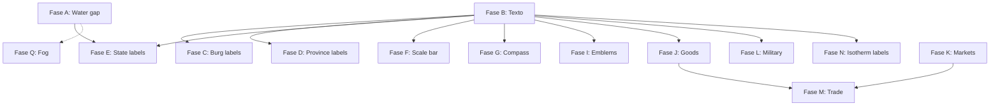

# Implementation plan: full rendering of Voronia

> **Based on**: Azgaar FMG analysis (`docs/analysis/landmass-drawing.md`)
> **Current state**: 19/28 layers implemented, 79 tests, functional wgpu pipeline
> **Objective**: Cover 100% of Azgaar's drawing layers in Voronia

---

## Summary of what already exists (don't touch)

| File | Layer | State |
|---------|------|--------|
| `heightmap.rs` | Elevation mesh | ✅ Complete |
| `relief.rs` | Relief triangles | ✅ Complete |
| `biome.rs` | Biome fill | ✅ Complete |
| `temperature.rs` | Isotherms (mesh) | ✅ Complete |
| `precipitation.rs` | Precipitation (mesh) | ✅ Complete |
| `ice_layer.rs` | Ice layers | ✅ Complete |
| `lakes.rs` | Catmull-Rom lakes | ✅ Complete |
| `river.rs` | Rivers meander + variable width | ✅ Complete |
| `coastline.rs` | Fractalized coastline | ✅ Complete |
| `state_layer.rs` | State fill | ✅ Complete |
| `province_layer.rs` | Province fill | ✅ Complete |
| `culture_layer.rs` | Culture fill | ✅ Complete |
| `religion_layer.rs` | Religion fill | ✅ Complete |
| `population_layer.rs` | Population map | ✅ Complete |
| `zone_layer.rs` | Zone overlays | ✅ Complete |
| `burg.rs` | Burg markers | ✅ Complete |
| `border.rs` | Borders (state/prov/culture) | ✅ Complete |
| `route_layer.rs` | Routes (roads/trails/searoutes) | ✅ Complete |
| `cells.rs` | Cell wireframe | ✅ Complete |
| `grid.rs` | Grid lines | ✅ Complete |
| `coordinates.rs` | Graticule coordinates | ✅ Complete |
| `contour.rs` | Height isolines | ✅ Complete |
| `texture.rs` | Texture overlay | ✅ Complete |
| `mesh.rs` | Shared builders | ✅ Complete |
| `renderer.rs` | wgpu pipeline | ✅ Complete |
| `camera.rs` | 2D camera | ✅ Complete |
| `layers.rs` | LayerFlags + order | ✅ Complete |

---

## What still needs to be implemented (ordered by dependencies)

### Phase A: Water gap technique + Landmask

**Why**: Azgaar draws a stroke in the same color as the fill on the borders of each region that touch water (water gap). Without this, the colors of states/biomes/etc. visually "bleed" into the ocean. The landmask used for clipping is also missing.

**Files to create/modify**:
| File | Action |
|---------|--------|
| `crates/vor-render/src/water_gap.rs` | **NEW** — Generate water gap paths for thematic layers |
| `crates/vor-render/src/landmask.rs` | **NEW** — Generate land/water mask as stencil or clip |
| `crates/vor-render/src/layers.rs` | Modify — Add layer index for landmask |
| `crates/vor-render/src/lib.rs` | Modify — Export new modules |
| `crates/vor-render/src/renderer.rs` | Modify — New pipeline with stencil test or mask render target |

**Algorithm**:
1. `landmask.rs`: Render all land features as white, lakes as black → mask texture
2. `water_gap.rs`: For each thematic layer (biomes, states, etc.), detect border cells against ocean/lake; draw a thin triangle (stroke) in the same color as the fill on those borders
3. Simpler alternative: use the existing `build_border_mesh` but with the layer's color instead of gray, only on borders against water

**Tests**: Visually compare that regions don't bleed into the ocean.
**Prior dependencies**: None (independent).

---

### Phase B: Text infrastructure (glyphon)

**Why**: All labels (burgs, provinces, states, scale bar) need text rendering. Azgaar uses SVG `<text>`, Voronia needs GPU text.

**Files to create/modify**:
| File | Action |
|---------|--------|
| `crates/vor-render/src/text.rs` | **NEW** — Text system with glyphon |
| `crates/vor-render/src/renderer.rs` | Modify — Add text_pass, text_overlay(), font_system |
| `crates/vor-render/src/lib.rs` | Modify — Export text module |
| `crates/vor-render/src/layers.rs` | Modify — New `NUM_LAYERS` constant if text is post-process |

**glyphon pipeline**:
1. Initialize `FontSystem` with a default font (load ttf from assets or embed it)
2. `TextRenderer` that handles `glyphon::TextRenderer` with wgpu
3. API: `render_text(&self, text: &str, x, y, size, color, align)` → draws into a buffer
4. Rendered as a post-MSAA overlay (last step before presenting)

**Test**: Draw "Hello World" on screen.
**Prior dependencies**: None (parallelizable with Phase A).

---

### Phase C: Burg labels

**Why**: Burgs currently only draw a triangle. Azgaar draws the burg's name next to it with a configurable offset.

**Files to create/modify**:
| File | Action |
|---------|--------|
| `crates/vor-render/src/burg_label.rs` | **NEW** — Burg labels |
| `crates/vor-render/src/layers.rs` | Modify — Connect label rendering |
| `crates/vor-render/src/lib.rs` | Modify — Export |

**Algorithm**:
```
1. Para cada burgo no eliminado:
   a. Calcular offset (dx, dy) desde center del burgo
   b. Renderizar texto con glyphon en esa posición
   c. Color: según grupo del burgo (capital=blanco, city=amarillo, etc.)
2. Orden Z: etiquetas sobre los marcadores de burgo
```

**Extractable style parameters**: font_size, offset_x, offset_y, color per group.
**Dependencies**: Phase B (text).

---

### Phase D: Province labels

**Why**: Azgaar shows each province's name centered in its territory. Voronia doesn't.

**Files to create/modify**:
| File | Action |
|---------|--------|
| `crates/vor-render/src/province_label.rs` | **NEW** — Province labels |
| `crates/vor-render/src/layers.rs` | Modify — Connect |
| `crates/vor-render/src/lib.rs` | Modify — Export |

**Algorithm**:
```
1. Para cada provincia:
   a. Obtener pole (polo de inaccesibilidad) desde Province.pole o center cell
   b. Renderizar texto centrado en esa posición
   c. Color: contraste con fill de provincia (blanco/negro según luminancia)
2. Orden Z: sobre relleno de provincia, bajo bordes
```

**Dependencies**: Phase B (text).

---

### Phase E: State labels (curved text)

**Why**: Azgaar uses a complex raycasting algorithm to place state names as curved text. It's the most complex labeling feature.

**Files to create/modify**:
| File | Action |
|---------|--------|
| `crates/vor-render/src/state_label.rs` | **NEW** — Raycasting + curved text |
| `crates/vor-render/src/layers.rs` | Modify — Connect |
| `crates/vor-render/src/lib.rs` | Modify — Export |

**Algorithm** (port of `draw-state-labels.ts:25-373`):
```
1. Para cada estado:
   a. Desde el pole, emitir rayos cada 9° hacia afuera
   b. Avanzar 5px por paso hasta salir del estado (findClosestCell)
   c. Encontrar el mejor par de rayos (izquierdo+derecho):
      - Suficiente longitud para el nombre
      - Preferir horizontales y ángulos obtusos
      - Score = longitud × horizontalidad × curvatura
   d. Conectar endpoints a través del pole con curveNatural
   e. En glyphon: no hay textPath nativo → alternativa:
      - Opción A: Calcular puntos a lo largo del path, renderizar caracteres individuales rotados
      - Opción B: Renderizar texto horizontal en la posición media del mejor par
   f. Validar bounding box dentro del estado (6 muestras rotadas)
   g. Fallback a nombre corto si no cabe
```

**Complexity**: High. Raycasting requires `findClosestCell` to know whether a point is inside the state.
**Dependencies**: Phase B (text), `vor-core::PackCells` (for `findClosestCell`).

---

### Phase F: Scale bar

**Why**: Azgaar draws a scale bar. Voronia has the flag `scale_bar: true` by default but renders nothing.

**Files to create/modify**:
| File | Action |
|---------|--------|
| `crates/vor-render/src/scale_bar.rs` | **NEW** — Scale bar |
| `crates/vor-render/src/layers.rs` | Modify — Connect |
| `crates/vor-render/src/lib.rs` | Modify — Export |

**Algorithm**:
```
1. Calcular distancia en km/pixel desde pack.coordinates o valor por defecto (kmPerPixel)
2. Elegir nice number: [1, 2, 5, 10, 20, 50, 100, 200, 500, 1000] km
3. Calcular longitud en píxeles = nice_number / kmPerPixel
4. Renderizar: rectángulo blanco con borde negro, divisiones, texto "XXX km"
5. Posición: esquina inferior izquierda con padding
```

**Shape**: Horizontal rectangle with a baseline, vertical tick marks at the ends, text centered above.
**Dependencies**: Phase B (text for the "XXX km").

---

### Phase G: Compass rose (wind rose)

**Why**: Azgaar draws a compass rose. Voronia has the flag `wind_rose: true` by default but renders nothing.

**Files to create/modify**:
| File | Action |
|---------|--------|
| `crates/vor-render/src/compass.rs` | **NEW** — Compass rose |
| `crates/vor-render/src/layers.rs` | Modify — Connect |
| `crates/vor-render/src/lib.rs` | Modify — Export |

**Algorithm**:
```
1. Posición: esquina inferior derecha con padding
2. Dibujar círculo exterior (stroke gris claro, radio 30px)
3. Dibujar 4 puntas cardinales (triángulos N/S/E/W)
4. Dibujar 4 puntas intercardinales (NE/SE/SW/NW) más pequeñas
5. Marcar N con punta roja/negra
6. Texto opcional "N" "S" "E" "W"
```

**Shape**: Circle with 8 compass points. N marked distinctively.
**Dependencies**: Phase B (optional text for N/S/E/W).

---

### Phase H: Vignette

**Why**: Azgaar darkens the map borders with a radial gradient (vignette). Voronia has the flag but doesn't implement it.

**Files to create/modify**:
| File | Action |
|---------|--------|
| `crates/vor-render/src/vignette.rs` | **NEW** — Edge vignette |
| `crates/vor-render/src/renderer.rs` | Modify — Fullscreen quad post-process |
| `crates/vor-render/src/layers.rs` | Modify — Connect |
| `crates/vor-render/src/lib.rs` | Modify — Export |

**Algorithm**:
```
Fullscreen quad con shader de vignette:
- Calcular distancia desde centro del viewport
- factor = smoothstep(0.3, 1.0, distance)
- color = mix(transparent, black(0.4), factor)
- Aplicar como blend multiply sobre el framebuffer
```

**WGSL shader** (~15 lines): compute UV, smoothstep, output color.
**Dependencies**: None (independent post-process).

---

### Phase I: Emblems (coats of arms)

**Why**: Azgaar renders coats of arms for burgs, provinces and states with D3 force simulation. Voronia has the flag.

**Files to create/modify**:
| File | Action |
|---------|--------|
| `crates/vor-render/src/emblem.rs` | **NEW** — Shield rendering |
| `crates/vor-render/src/layers.rs` | Modify — Connect |
| `crates/vor-render/src/lib.rs` | Modify — Export |

**Algorithm** (simplified, without D3 force):
```
1. Para cada entidad con emblema:
   a. Obtener colores del escudo (field, charge, ordinaries)
   b. Tamaño: auto según número de entidades
   c. Renderizar como cuadrado/rectángulo coloreado con patrón simple
2. Posición:
   - Burgo: sobre el marcador
   - Provincia: en el pole o centro
   - Estado: en la capital
3. Sin force simulation (MVP): posición fija
```

**MVP**: Shield as a colored rectangle with a gold border.
**Full**: SVG-like shield shapes (inverted triangle + straight base).
**Dependencies**: Phase B (text for the name on the shield, optional).

---

### Phase J: Goods layer

**Why**: Azgaar colors cells by type of produced good, with icons and burg plates. Voronia has the flag `goods: bool`.

**Files to create/modify**:
| File | Action |
|---------|--------|
| `crates/vor-render/src/goods.rs` | **NEW** — Three sub-layers: goodsCells, goodsIcons, goodsBurgs |
| `crates/vor-render/src/layers.rs` | Modify — Connect goods layer |
| `crates/vor-render/src/lib.rs` | Modify — Export |

**Sub-layers**:
1. **goodsCells**: Use `build_pack_mesh` coloring each cell by good type, opacity normalized to maximum production
2. **goodsIcons**: Circles or triangles in cells with significant production
3. **goodsBurgs**: Plates (rectangles) in burgs with top-3 goods

**Dependencies**: Phase B (text for names on burg plates).

---

### Phase K: Markets layer

**Why**: Azgaar draws market areas of influence as colored isolines + icon. Voronia has the flag.

**Files to create/modify**:
| File | Action |
|---------|--------|
| `crates/vor-render/src/market.rs` | **NEW** — Market areas |
| `crates/vor-render/src/layers.rs` | Modify — Connect |
| `crates/vor-render/src/lib.rs` | Modify — Export |

**Algorithm**:
```
1. Para cada mercado:
   a. Obtener la zona de influencia (isoline polygon)
   b. Renderizar como mesh coloreado con el color del mercado (alpha 0.3)
   c. Renderizar círculo sólido en el burgo central
```

**Dependencies**: None (uses existing `build_pack_mesh`).

---

### Phase L: Military layer

**Why**: Azgaar draws regiments as colored rectangles. Voronia doesn't implement it.

**Files to create/modify**:
| File | Action |
|---------|--------|
| `crates/vor-render/src/military.rs` | **NEW** — Regiments |
| `crates/vor-render/src/layers.rs` | Modify — Connect |
| `crates/vor-render/src/lib.rs` | Modify — Export |

**Algorithm**:
```
1. Para cada regimiento:
   a. Posición: coordenadas del burg o celda asignada
   b. Tamaño: proporcional al número de tropas
   c. Color: del estado propietario
   d. Renderizar: rectángulo con borde más oscuro + texto de conteo
```

**MVP**: Colored rectangle without text.
**Dependencies**: Phase B (text for troop count, optional).

---

### Phase M: Trade layer (trade animation)

**Why**: Azgaar animates trade routes with moving markers. Voronia has the flag `trade: bool`.

**Files to create/modify**:
| File | Action |
|---------|--------|
| `crates/vor-render/src/trade.rs` | **NEW** — Trade animation |
| `crates/vor-render/src/layers.rs` | Modify — Connect |
| `crates/vor-render/src/lib.rs` | Modify — Export |

**Algorithm**:
```
1. Para cada ruta comercial:
   a. Calcular punto actual = lerp entre origen y destino según tiempo
   b. Dibujar marcador (círculo/diamante) en ese punto
   c. Color: según bien comerciado
2. Timing: uniforme para todas las rutas (ej. 30s ciclo completo)
```

**Dependencies**: Phase K (markets). Requires `vor-core` to have trade data.

---

### Phase N: Isotherms with labels

**Why**: Azgaar draws temperature labels (e.g. "10°C", "20°C") on each isotherm band. Voronia renders the temperature mesh but without labels.

**Files to create/modify**:
| File | Action |
|---------|--------|
| `crates/vor-render/src/temperature.rs` | Modify — Add temperature labels |
| (or create `crates/vor-render/src/isotherm_label.rs`) | Separate option |

**Algorithm**:
```
1. Después de renderizar el mesh de temperatura:
   a. Para cada nivel de isoterma, encontrar un punto en el centro del mapa
   b. Renderizar texto "XX°C" en ese punto
   c. Color: contraste con el fill de la banda
```

**Dependencies**: Phase B (text).

---

### Phase O: Animated precipitation circles

**Why**: Azgaar animates the appearance of precipitation circles with an 800ms transition. Voronia renders as a static mesh.

**Files to create/modify**:
| File | Action |
|---------|--------|
| `crates/vor-render/src/precipitation.rs` | Modify — Add animation |

**Algorithm**:
```
Alternativa 1: Círculos instanciados (en vez de mesh de celdas)
- Para cada celda con prec > 0: calcular radio = sqrt(prec/4) / modifier
- Renderizar como CircleList o triángulos instanciados
- Animar radio con función de tiempo (lerp 0 → radio final en 800ms)

Alternativa 2: Mantener mesh actual pero con alpha animado
```

**Dependencies**: None (local change).

---

### Phase P: Animated population bars

**Why**: Azgaar animates the height of the population bars (2000ms transition). Voronia renders as a static mesh.

**Files to create/modify**:
| File | Action |
|---------|--------|
| `crates/vor-render/src/population_layer.rs` | Modify — Add animation |

**Analogous to Phase O**: animate bar height or alpha.
**Dependencies**: None.

---

### Phase Q: Fog of war (state fog)

**Why**: Azgaar darkens everything except the focused state. Voronia has the `markers` flag but no `fog`.

**Files to create/modify**:
| File | Action |
|---------|--------|
| `crates/vor-render/src/fog.rs` | **NEW** — Fog of war |
| `crates/vor-render/src/layers.rs` | Modify — Connect, add fog flag |
| `crates/vor-render/src/lib.rs` | Modify — Export |

**Algorithm**:
```
1. Cuando un estado está "enfocado":
   a. Crear mesh de todas las celdas NO del estado enfocado
   b. Renderizar como overlay negro semi-transparente (alpha ~0.7)
2. Estado enfocado se mantiene a full brillo
```

**Dependencies**: Phase A (landmask for clipping).

---

### Phase R: Expanded burg icons

**Why**: Azgaar has 15+ icon shapes (circle, square, triangle, cross, star, capital, city, town, etc.). Voronia only draws triangles.

**Files to create/modify**:
| File | Action |
|---------|--------|
| `crates/vor-render/src/burg.rs` | Modify — Add icon shapes |

**Shapes to implement**:
- Circle (currently none, only triangle)
- Square
- Triangle ✅ (already exists)
- Cross
- Star (4 points)
- Capital (circle with crown)
- Port (anchor)

**Implementation**: Each shape is a set of triangles generated on the CPU around the point (x,y).
**Dependencies**: None.

---

## Recommended implementation order

```
Fase A: Water gap + landmask    [Alta prioridad — calidad visual crítica]
Fase B: Texto (glyphon)         [Alta prioridad — prerrequisito de todas las labels]
Fase C: Burg labels             [Alta — info básica de asentamientos]
Fase D: Province labels         [Alta — info básica administrativa]
Fase H: Vignette                [Media — decorativo, fácil]
Fase F: Scale bar               [Media — info de mapa]
Fase G: Compass rose            [Media — decorativo, fácil]
Fase R: Burg icons expandidos   [Media — polaco visual]
Fase E: State labels (curvo)    [Media — complejo pero importante]
Fase N: Isotherm labels         [Baja — info climática]
Fase O: Precipitation animation [Baja — polaco visual]
Fase P: Population animation    [Baja — polaco visual]
Fase I: Emblems                 [Baja — decorativo, complejo]
Fase J: Goods                   [Baja — data overlay]
Fase K: Markets                 [Baja — data overlay]
Fase L: Military                [Baja — data overlay]
Fase M: Trade animation         [Baja — data overlay]
Fase Q: Fog of war              [Baja — gameplay]
```

---

## Dependencies between phases



---

## What is NOT implemented (for now)

| Feature | Reason |
|---------|-------|
| **Satellite texture (3D)** | Requires WebGL/Three.js, completely outside the wgpu 2D pipeline |
| **D3 force simulation** (emblems) | Requires D3 integration or a complex port; MVP uses fixed position |
| **SVG path rendering** (curved text) | glyphon doesn't support native textPath; simplified alternative |
| **Map legend** | Depends on which layers are active; low priority |
| **User markers** | Requires editing interaction; Phase 6 |
| **Ruler/measurement** | Requires editing interaction; Phase 6 |

---

## Estimated workload

| Phase | New files | Modified files | Estimated days |
|------|----------------|---------------------|----------------|
| A (Water gap) | 2 | 3 | 1 |
| B (Text) | 1 | 2 | 2 |
| C (Burg labels) | 1 | 2 | 0.5 |
| D (Province labels) | 1 | 2 | 0.5 |
| E (State labels) | 1 | 2 | 2-3 |
| F (Scale bar) | 1 | 2 | 0.5 |
| G (Compass) | 1 | 2 | 0.5 |
| H (Vignette) | 1 | 2 | 0.5 |
| I (Emblems) | 1 | 2 | 1 |
| J (Goods) | 1 | 2 | 1 |
| K (Markets) | 1 | 2 | 1 |
| L (Military) | 1 | 2 | 0.5 |
| M (Trade) | 1 | 2 | 1 |
| N (Isotherm labels) | 0 | 1 | 0.5 |
| O (Precip animation) | 0 | 1 | 0.5 |
| P (Pop animation) | 0 | 1 | 0.5 |
| Q (Fog) | 1 | 2 | 1 |
| R (Burg icons) | 0 | 1 | 1 |

**Total**: ~15 new files, ~30 modifications, ~15 estimated days.

---

## Next step

Execute Phase A (water gap + landmask), which has the most visual impact and is an indirect prerequisite for state labels. It's independent of text and can be done without glyphon.
